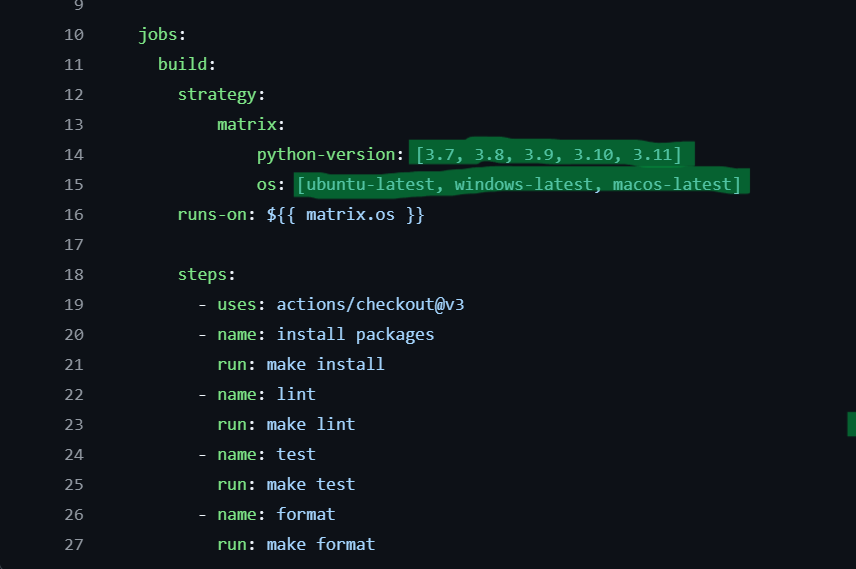
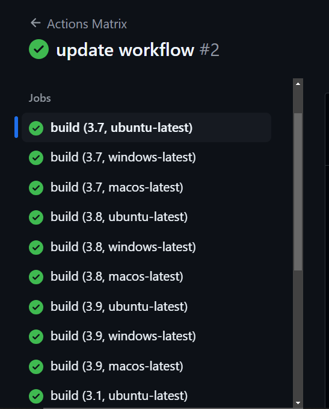

# GitHub Actions Matrix Build for Multiple Python Versions and Operating Systems
[](https://github.com/nogibjj/mts79-week4/actions/workflows/cicd.yml)


The purpose of this project is to implement a testing framework that ensures the codebase is compatible across multiple Python versions. By using GitHub Actions, the project automates the process of running tests whenever code changes are made. This setup helps catch compatibility issues early, promotes best practices in code quality, and ensures that the application runs smoothly in different environments.

## Overview
Ensuring that your code functions correctly across various Python versions and operating systems is crucial for providing a seamless experience for all users. This GitHub Actions workflow automates the testing and building process by leveraging a matrix that includes **five** different Python versions and **three** distinct operating systems.

For further insights, you can explore the `.github/workflows` folder in this repository, where you’ll find the YAML file we created. In this file, we’ve specified the various Python versions and operating systems used for our testing, as outlined below:


## Getting Started
1. **Clone the repository:**

    ```bash
    git clone https://github.com/nogibjj/mts79-week4/tree/main
    ```

2. **Navigate into the project directory:**

    ```bash
    cd mts79-week4
    ```

3. **Navigate to the workflows file**

    ```bash
    cd .github/workflows/cicd.yml
    ```
4. **Modify the python and os lists according to your needs**
5. **Install the required dependencies:**

    You can find the list of required packages in the `requirements.txt` file. Run the following command to install them:

    ```bash
    pip install -r requirements.txt
    ```
6. **Run the script:**

    ```bash
    python main.py
    python test_main.py
    ```
### Below is a demonstration of the different operating systems and Python versions we’ve utilized. You can also view the details by clicking the provided Actions Matrix Badge above and expanding the workflow run.


